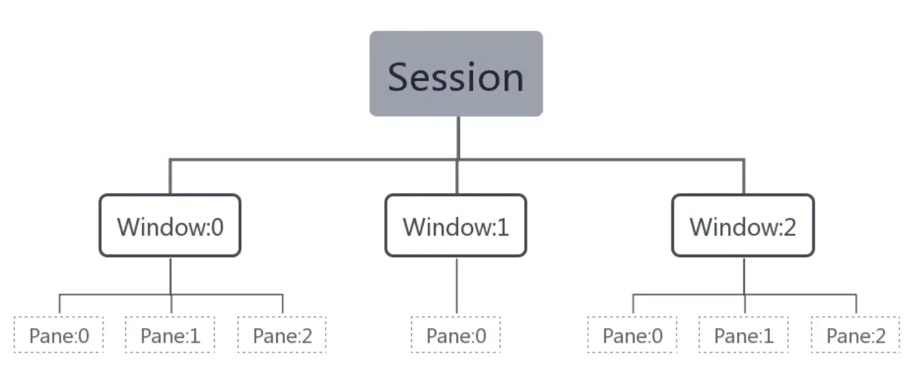
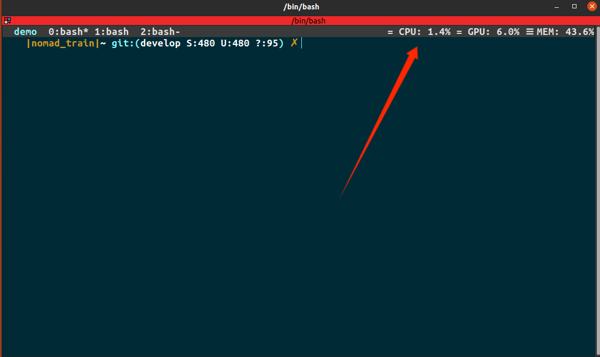

# tmux

## 简介

`tmux`（Terminal Multiplexer） 是一个终端复用器，它允许你在一个单一的终端窗口中运行多个终端会话，并在不同的会话之间轻松切换

## 基本概念

Tmux中有几个概念，分别是Session会话、Window窗口和Pane面板，它们之间的关系如下图所示：



在Tmux服务中，可有多个Session，一个Session下可有多个Window，一个Window下可有多个Pane。
在创建一个Session时，会默认创建一个Window，包括一个Pane。

## 特性

- 持久会话：`tmux` 允许你启动一个会话，然后可以随时断开连接，而不终止该会话中的进程。
- 多窗口和多面板：`tmux` 允许你在同一个会话中打开多个窗口，每个窗口可以分割成多个面板。
- 团队协作：`tmux` 支持多用户连接到同一个会话，看到相同的终端输出，并且可以共同操作。

## 使用

在Linux中安装：

```sh
sudo apt-get install tmux
```

新建会话：

```sh
tmux new -s demo # 新建一个名称为demo的会话
```

断开会话：

```sh
tmux detach # 断开当前会话，会话在后台运行
```

进入会话：

```sh
tmux a -t demo # 进入到名称为demo的会话
```

查看所有会话：

```sh
tmux ls
```

进入会话列表：先按`Ctrl+b`，再按`s`（`Ctrl+b`是默认的`prefix`，后面我们改成`Ctrl+a`更方便）

此时tmux将打开一个会话列表，按上下键(⬆︎⬇︎)或者鼠标滚轮，可选中目标会话，按左右键（⬅︎➜）可收起或展开会话的窗口，选中目标会话或窗口后，按回车键即可完成切换。 

关闭会话：

```
tmux kill-session -t demo # 关闭demo会话 
tmux kill-server # 关闭服务器，所有的会话都将关闭
```

## 设置

希望给状态条显示cpu等参数，需要使用[tpm](https://github.com/tmux-plugins/tpm)安装插件[tmux-cpu](https://github.com/tmux-plugins/tmux-cpu?tab=readme-ov-file)，然后配置status就可以显示了

首先下载插件管理工具[tpm](https://github.com/tmux-plugins/tpm)

```
git clone https://github.com/tmux-plugins/tpm ~/.tmux/plugins/tpm
```

然后使用`vim ~/.tmux.conf`命令，在`~/.tmux.conf`文件中加入插件

```
# 状态条显示在上方
set-option -g status-position top

# 鼠标拖动、选择功能
set-option -g mouse on

# 修改leader键为Ctrl+a
unbind C-b
set-option -g prefix C-a
bind-key C-a send-prefix

# List of plugins
set -g @plugin 'tmux-plugins/tpm'
set -g @plugin 'tmux-plugins/tmux-sensible'
set -g @plugin 'tmux-plugins/tmux-cpu'
set -g @plugin 'xamut/tmux-network-bandwidth'

# 状态栏样式
set -g status-style "fg=#D8DEE9,bg=#2E3440"  # 柔和的浅灰前景和深灰背景

# CPU 使用率配置
set -g @cpu_low_icon "="
set -g @cpu_medium_icon "≡"
set -g @cpu_high_icon "≣"

set -g @cpu_percentage_format "%3.1f%%"
set -g @cpu_medium_thresh "30"
set -g @cpu_high_thresh "80"

# RAM 使用率配置 (与CPU类似)
set -g @ram_low_icon "="
set -g @ram_medium_icon "≡"
set -g @ram_high_icon "≣"

set -g @ram_percentage_format "%3.1f%%"
set -g @ram_medium_thresh "30"
set -g @ram_high_thresh "80"

# GPU 使用率配置 (与CPU类似)
set -g @gpu_low_icon "="
set -g @gpu_medium_icon "≡"
set -g @gpu_high_icon "≣"

set -g @gpu_percentage_format "%3.1f%%"
set -g @gpu_medium_thresh "30"
set -g @gpu_high_thresh "80"

# 状态栏左侧显示的内容
set -g status-left "#[fg=#7DF9FF,bg=#2E3440,bold]  #S  "

# 状态栏右侧显示的内容
set -g status-right " #{prefix_highlight} #{cpu_icon} CPU: #{cpu_percentage} #{gpu_icon} GPU: #{gpu_percentage} #{ram_icon} MEM: #{ram_percentage}"

# Initialize TMUX plugin manager (keep this line at the very bottom of tmux.conf)
run '~/.tmux/plugins/tpm/tpm'
```

重新加载一下

```
tmux source ~/.tmux.conf
```

在任意tmux窗口中按下`Ctrl+a`再按`I`，稍等片刻CPU、GPU、内存这些信息就显示出来了，如下图



## 参考

https://segmentfault.com/a/1190000040004297

https://louiszhai.github.io/2017/09/30/tmux/#%E9%9D%A2%E6%9D%BF%E5%A4%A7%E5%B0%8F%E8%B0%83%E6%95%B4

https://bbs.tampermonkey.net.cn/thread-2954-1-1.html

## TODO

- 需要ssh远程打开多个终端时，tmux的使用方法介绍
